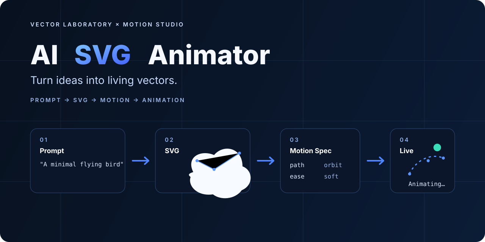
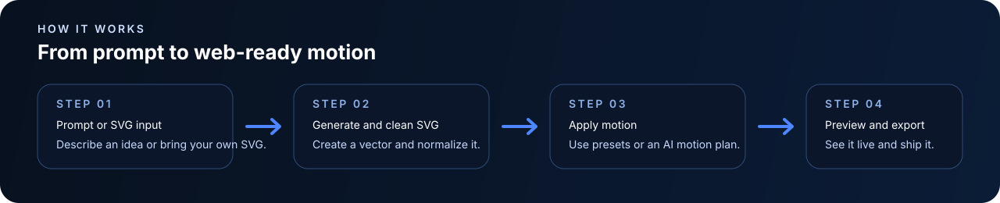

<p align="right"><a href="./README.ru.md"><strong>Русский</strong></a></p>

<p align="center">
  
</p>

<h1 align="center">AI SVG Animator</h1>
<p align="center"><strong>Turn ideas into living vectors.</strong></p>
<p align="center">SVG → Motion → Web · Prompt → SVG coming next</p>

<p align="center">
  <a href="./docs/PRODUCT_PLAN.md">Product Plan</a> ·
  <a href="./docs/LOCALIZATION.md">Localization</a>
</p>

## Current build

**Milestone 1 — Static Animator is implemented.**

The app can now take an existing SVG and turn it into a controllable web animation:

- paste or upload an SVG;
- sanitize unsafe SVG markup with DOMPurify;
- normalize sizing / `viewBox` and tag animatable geometry;
- preview it on a live canvas;
- apply **Reveal**, **Draw**, or **Float**;
- tune duration, intensity, and looping;
- switch the full UI between **English / Russian** without losing the current work;
- download the normalized SVG;
- export a **self-contained HTML file** with no runtime CDN dependency.

The next milestone connects **RouterAI / Recraft Vector**, so a user can start from a text prompt instead of bringing an SVG.

## How it works

<p align="center">
  
</p>

```text
SVG input
   │
   ▼
DOMPurify sanitizer
   │
   ▼
SVG normalizer + stable animation targets
   │
   ▼
GSAP preview engine
   ├── Reveal
   ├── Draw
   └── Float
   │
   ▼
Live preview + SVG / standalone HTML export
```

## Why this project exists

Animated SVG assets sit in an awkward gap. AI image tools usually stop at raster output, design tools can export vectors but do not automate motion well, and full motion suites can be too heavy for quick product work.

AI SVG Animator is aiming for a simpler path:

> **Describe or bring a vector → make it move → ship it to the web.**

## Run locally

Requirements: a modern Node.js release supported by Vite 8.

```bash
git clone https://github.com/conradipui-glitch/AI-SVG-Animator.git
cd AI-SVG-Animator
npm install
npm run dev
```

Production build:

```bash
npm run build
npm run preview
```

## Stack

- **Vite 8** — frontend build / dev server
- **TypeScript 7** — typed application layer
- **GSAP 3.15** — live SVG animation runtime
- **DOMPurify 3.4** — SVG sanitization before inline rendering
- browser **Web Animations API** — dependency-free exported HTML animation

## Project structure

```text
src/
├── animator.ts       # Reveal / Draw / Float GSAP presets
├── export.ts         # standalone HTML + file downloads
├── main.ts           # app state, UI and interactions
├── sample.ts         # built-in demo vector
├── styles.css        # Vector Laboratory × Motion Studio UI
├── svg.ts            # sanitization + normalization
└── i18n/
    ├── index.ts      # locale resolution + persistence
    ├── en.ts
    ├── ru.ts
    └── types.ts
```

## Design direction

The product uses a visual identity we call **Vector Laboratory × Motion Studio**:

- deep navy / graphite surfaces;
- restrained electric-blue accents;
- Bézier / anchor / motion-path visual language;
- a hybrid of a design tool and a developer tool.

No mystical neon AI brain required 😄

## Localization

The MVP is bilingual:

- **English**
- **Русский**

Resolution order: saved manual choice → browser/system language → country fallback → English. A manual choice always wins and is persisted locally.

See [`docs/LOCALIZATION.md`](./docs/LOCALIZATION.md).

## Roadmap

### ✅ Milestone 0 — foundation
- product plan;
- bilingual README and visual identity;
- localization architecture.

### ✅ Milestone 1 — Static Animator
- SVG paste / upload;
- sanitizer + normalizer;
- Reveal / Draw / Float;
- live preview;
- duration / intensity / loop controls;
- normalized SVG export;
- standalone HTML export.

### ▶ Milestone 2 — AI SVG generation
- RouterAI / Recraft Vector adapter;
- prompt → SVG;
- prompt → SVG → animation end-to-end;
- provider error / rate handling;
- Cloudflare Worker boundary for secrets.

### Milestone 3 — AI motion
- semantic SVG analyzer;
- Motion Spec JSON;
- AI motion planner;
- editable motion variations.

### Milestone 4 — public MVP polish
- deployment;
- responsive QA;
- real demo asset / animated README example;
- smoke tests;
- Lottie / video export experiments.

## Docs

- [`docs/PRODUCT_PLAN.md`](./docs/PRODUCT_PLAN.md) — product thesis, architecture and milestones.
- [`docs/LOCALIZATION.md`](./docs/LOCALIZATION.md) — RU / EN strategy.

## Vision

> Type an idea. Get a clean SVG. Make it move. Ship it to the web.
