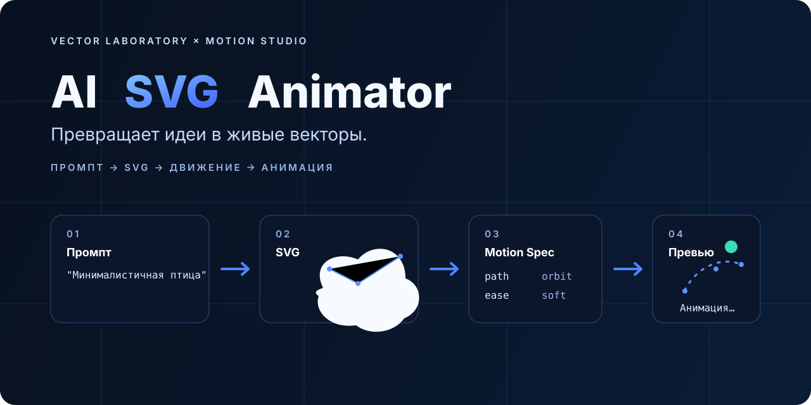
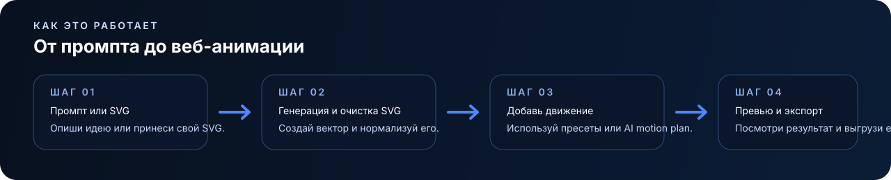

<p align="right"><a href="./README.md"><strong>English</strong></a></p>

<p align="center">
  
</p>

<h1 align="center">AI SVG Animator</h1>
<p align="center"><strong>Превращает идеи в живые векторы.</strong></p>
<p align="center">SVG → Motion-Ready Map → AI Motion → Веб · Визуальный + структурный анализ · Автоварианты</p>

<p align="center">
  <a href="https://ai-svg-animator.conradipui.workers.dev"><strong>Открыть приложение</strong></a> ·
  <a href="./docs/PRODUCT_PLAN.md">План продукта</a> ·
  <a href="./docs/MILESTONE_2_2.md">Milestone 2.2</a> ·
  <a href="./docs/MOTION_SPEC.md">Motion Spec</a> ·
  <a href="./docs/MODEL_ROUTING.md">Маршрутизация моделей</a>
</p>

## Текущий билд

**Static Animator, AI Motion 2.1 и техническая реализация Motion-Ready SVG Preparation 2.2 уже работают в production.**

Живое приложение умеет:

- вставлять SVG-код или загружать `.svg` и удалять небезопасную разметку через DOMPurify;
- нормализовать `viewBox` и назначать стабильные ID графическим элементам и существующим SVG-группам;
- показывать результат на живом холсте;
- применять deterministic presets **Reveal / Draw / Float**;
- настраивать длительность, интенсивность и цикл;
- переключать весь UI **RU / EN** без потери работы;
- после нормализации строить локальную **Motion-Ready Scene Map**;
- оценивать готовность SVG к движению и показывать логические группы, семантические подсказки, pivot hints, motion potential и кандидатов на разделение;
- консервативно распознавать смысл элементов по SVG IDs, labels, titles, classes и метаданным на русском и английском;
- опционально запускать **«Разобрать части с AI»**, передавая модели и визуальный рендер, и структурную карту;
- отклонять выдуманные моделью ID вместо того, чтобы применять их к SVG;
- показывать рекомендации на разделение, если глаз, рука, крыло, колесо, ветка, часть одежды или другой потенциально подвижный элемент визуально существует, но слит с более крупным path/group;
- выбирать доступную бесплатную модель B.AI;
- описывать движение естественным языком и один раз нажимать **«✨ Анимировать с AI»**;
- использовать пустой промпт для автоматической умеренной анимации;
- отправлять модели одновременно PNG-рендер и структурный SVG-контекст;
- позволять AI-анимации обращаться как к целой логической `<g>`-группе, так и к отдельному shape;
- учитывать semantic pivot hints для вращения частей вокруг правдоподобных точек крепления;
- валидировать **Motion Spec v1** только по существующим motion targets;
- сохранять валидные tracks, даже если часть AI-ответа некорректна;
- автоматически запускать корректную AI-анимацию через GSAP;
- генерировать варианты **Subtle / Natural / Expressive**;
- показывать provider/model/validation diagnostics в **«Технических деталях»**;
- скачивать подготовленный SVG;
- экспортировать активную preset- или AI-анимацию в автономный HTML с сохранением semantic pivot поведения.

### Статус production AI

Production smoke-tests проходят на:

`https://ai-svg-animator.conradipui.workers.dev`

- B.AI health / model discovery: OK;
- все четыре настроенные бесплатные B.AI-модели видны текущему credential;
- AI Motion generation: HTTP 200, валидный Motion Spec;
- Motion-Ready semantic preparation: HTTP 200, принята карта только с существующими ID;
- генерация трёх auto variants: HTTP 200;
- provider keys остаются только на серверной стороне в Cloudflare Worker Secrets.

Для окончательной авторской проверки Milestone 2.2 остаётся browser QA на нескольких реальных SVG: как минимум на персонаже с отдельными частями и на плоской/монолитной иллюстрации. Подробности: [`docs/MILESTONE_2_2.md`](./docs/MILESTONE_2_2.md).

## Как это работает

<p align="center">
  
</p>

```text
SVG на входе
   │
   ▼
DOMPurify sanitizer
   │
   ▼
SVG normalizer + стабильные shape/group targets
   │
   ▼
Motion-Ready Scene Map
roles · hierarchy · pivots · split candidates
   │
   ├──────── deterministic presets ────────────────┐
   │                                                │
   ├──► PNG-рендер для визуального анализа          │
   │                                                │
   └──► semantic SVG structure / IDs / geometry     │
                │                                   │
                ▼                                   │
       мультимодальная модель B.AI                  │
       + резерв Cloudflare                          │
                │                                   │
                ├──► semantic preparation           │
                ├──► один Motion Spec               │
                └──► 3 auto variants                │
                │                                   │
                ▼                                   │
      allowlist + clamps + validation               │
                │                                   │
                └────────► GSAP renderer ◄──────────┘
                                 │
                                 ▼
                           Живое превью
                                 │
                                 ▼
                         автономный HTML
```

## Зачем нужен этот проект

Анимированный SVG находится в неудобной промежуточной зоне: AI-генераторы обычно заканчиваются на растре, дизайн-инструменты умеют экспортировать вектор, но плохо автоматизируют motion, а полноценные motion-пакеты избыточны для быстрой продуктовой работы.

AI SVG Animator строит более короткий путь:

> **Опиши или принеси вектор → пойми его части → оживи → отправь в веб.**

Долгосрочная цель — **AI Motion Director**, который понимает сцену по смыслу, готовит изображение к движению, предлагает несколько сценариев и в дальнейшем сможет перестраивать векторную геометрию, если исходник плохо подготовлен к анимации.

## Граница безопасности

Milestone 2.2 специально **не даёт модели разрушительно переписывать path-геометрию**.

- AI не пишет исполняемый JavaScript или CSS.
- AI может размечать только ID, которые уже существуют в очищенном SVG.
- Motion Spec принимает только зарегистрированные motion targets.
- Локальная подготовка не меняет path geometry.
- Если визуально существующая подвижная часть слита с одним монолитным shape, система выдаёт рекомендацию на разделение, а не притворяется, что отдельный объект уже существует.

Настоящая vector decomposition / regeneration вынесена в отдельный будущий этап.

## Маршрутизация AI

Во время разработки MVP Worker предпочитает актуальные бесплатные маршруты B.AI, а Cloudflare Workers AI держит как резерв.

Сейчас в пуле:

- `glm-5.3-flash` — text + vision;
- `qwen3.8-flash` — text + vision;
- `mimo-v2.5` — text + vision;
- `hy3` — только text.

Браузер никогда не получает provider API keys. Подробности: [`docs/MODEL_ROUTING.md`](./docs/MODEL_ROUTING.md).

## Локальный запуск

Нужна современная версия Node.js, поддерживаемая Vite 8.

```bash
git clone https://github.com/conradipui-glitch/AI-SVG-Animator.git
cd AI-SVG-Animator
npm install
npm run dev
```

Локальный Worker:

```bash
cp .dev.vars.example .dev.vars
npm run dev:worker
```

Production checks:

```bash
npm run build
npm run check:worker
```

Деплой описан в [`docs/DEPLOY.md`](./docs/DEPLOY.md).

## Стек

- **Vite 8** — frontend build / dev server
- **TypeScript 7** — типизированный application layer
- **GSAP 3.15** — runtime живой SVG-анимации
- **DOMPurify 3.4** — очистка SVG перед inline-рендером
- **Cloudflare Workers** — API boundary + static deployment
- **Cloudflare Workers AI** — резервный AI-маршрут
- **B.AI OpenAI-compatible API** — пул бесплатных моделей для MVP
- browser **Canvas** — SVG → PNG visual context для мультимодального анализа
- browser **Web Animations API** — автономный HTML-export

## Структура

```text
src/
├── ai.ts             # AI API client + semantic visual/structural context
├── animator.ts       # presets + pivot-aware Motion Spec GSAP executor
├── export.ts         # standalone preset / AI animation HTML export
├── main.ts           # состояние, Motion-Ready UI, AI motion и variants
├── motion-spec.ts    # tolerant Motion Spec v1 parser / validator
├── scene-map.ts      # semantic map, pivots, readiness и split candidates
├── readiness.css     # стили Motion-Ready панели
├── sample.ts         # встроенный демонстрационный вектор
├── styles.css        # Vector Laboratory × Motion Studio UI
├── svg.ts            # sanitization + shape/group normalization
└── i18n/
    ├── index.ts
    ├── en.ts
    ├── ru.ts
    └── types.ts

worker/
└── index.ts           # B.AI motion/prepare/variants/vision + Cloudflare fallback
```

## Визуальное направление

Продукт использует стиль **Vector Laboratory × Motion Studio**:

- глубокая navy / graphite база;
- сдержанный electric-blue;
- язык Bézier-кривых, anchor points и motion paths;
- ощущение гибрида дизайн-инструмента и developer tool.

И да — без обязательного мистического неонового AI-мозга 😄

## Локализация

MVP двуязычный:

- **English**
- **Русский**

Приоритет: сохранённый ручной выбор → язык браузера / системы → географический fallback → English. Ручной выбор всегда главный и сохраняется локально.

Подробности: [`docs/LOCALIZATION.md`](./docs/LOCALIZATION.md).

## Дорожная карта

### ✅ Milestone 0 — foundation
- план продукта;
- двуязычный README и visual identity;
- архитектура локализации.

### ✅ Milestone 1 — Static Animator
- вставка / загрузка SVG;
- sanitizer + normalizer;
- Reveal / Draw / Float;
- live preview;
- duration / intensity / loop;
- экспорт очищенного SVG;
- автономный preset HTML export.

### 🟢 Milestone 2.1 — AI Motion + Auto Variants
- live B.AI motion route;
- one-click **«Анимировать с AI»**;
- visual + structural SVG context;
- tolerant Motion Spec validation;
- автоматическое GSAP-воспроизведение;
- варианты Subtle / Natural / Expressive;
- diagnostics / partial validation;
- автономный export AI-анимации;
- более широкий ручной browser acceptance всё ещё полезен.

### 🟢 Milestone 2.2 — Motion-Ready SVG Preparation
- стабильные motion targets для shapes и groups;
- локальная semantic scene map;
- оценка motion readiness;
- semantic labels, motion potential и pivot hints;
- опциональный AI-анализ частей по визуальному и SVG-контексту;
- существующие-ID-only semantic validation;
- рекомендации на разделение merged parts;
- group-level Motion Specs и pivot-aware GSAP/export;
- production smoke-test `/api/ai/prepare` пройден;
- real-world browser fixture QA остаётся.

### ▶ Milestone 3 — Semantic Motion Director
- более богатая иерархия сцены и объектов;
- relationship-aware choreography для parent/child частей;
- motion roles: primary subject, secondary motion, atmosphere и static anchors;
- semantic motion recipes для персонажей, транспорта, природы и interface graphics;
- автоматический выбор стратегии по визуальному смыслу;
- подготовка границы для controlled vector decomposition / regeneration.

### Поздние decomposition / input / generation layers
- preserve-and-regroup существующей SVG-геометрии;
- регенерация motion-friendly layered SVG;
- raster image → motion-ready vector или hybrid layered scene;
- prompt → SVG generation;
- Universal Import Layer для SVG/SVGZ, EPS/PS/AI/PDF и затем дополнительных vector-форматов;
- layered / hybrid SVG + PNG/WebP scenes.

### Public MVP polish
- responsive QA;
- реальный demo asset / анимированный README-пример, сделанный самим инструментом;
- расширенные browser fixture tests;
- эксперименты с Lottie / video export.

## Документы

- [`docs/PRODUCT_PLAN.md`](./docs/PRODUCT_PLAN.md) — гипотеза, архитектура и этапы.
- [`docs/MILESTONE_2_1.md`](./docs/MILESTONE_2_1.md) — спецификация AI Motion.
- [`docs/MILESTONE_2_2.md`](./docs/MILESTONE_2_2.md) — Motion-Ready SVG preparation и safety boundary.
- [`docs/MOTION_SPEC.md`](./docs/MOTION_SPEC.md) — контролируемый контракт AI → renderer.
- [`docs/MODEL_ROUTING.md`](./docs/MODEL_ROUTING.md) — B.AI + Cloudflare routing.
- [`docs/DEPLOY.md`](./docs/DEPLOY.md) — безопасный Cloudflare deployment.
- [`docs/LOCALIZATION.md`](./docs/LOCALIZATION.md) — стратегия RU / EN.

## Видение

> Опиши идею. Получи чистый SVG. Пойми его части. Оживи. Отправь в веб.